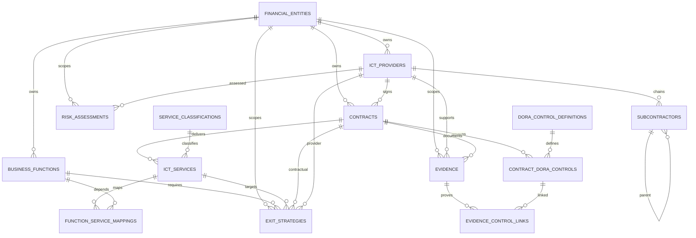

# Cloud Business Resilience Platform / DORA Blueprint (`Azelos_DORA_BP`)

DORA remains a first-class framework; see [docs/CLOUD-RESILIENCE-PLATFORM.md](docs/CLOUD-RESILIENCE-PLATFORM.md) and [docs/CLOUD-RESILIENCE-IMPLEMENTATION-REPORT.md](docs/CLOUD-RESILIENCE-IMPLEMENTATION-REPORT.md).

PostgreSQL source-of-truth for ICT third-party / supplier risk under DORA — **not** the APIO marketplace app in `maisonmaroc/`.

## Stack (this folder)

- PostgreSQL 16
- SQLAlchemy 2.x ORM
- Alembic migrations
- pytest integration tests

FastAPI, React, GraphQL, and Terraform are **out of scope** here. **PostgreSQL hosting** and **object storage** are configuration-only (no cloud SDK in the core path).

## Portability

- **Database:** client-provided PostgreSQL 16+ via `DATABASE_URL` only ([database contract](docs/DATABASE-CONTRACT.md)).
- **Storage:** pluggable `EvidenceStorage` — `local` today; Azure/S3/MinIO adapters stubbed ([storage architecture](docs/STORAGE-ARCHITECTURE.md)).
- **Deploy:** [DEPLOYMENT.md](docs/DEPLOYMENT.md)

## Web UI (fix “site can’t be reached”)

The React app runs **on your machine**, not on GitHub or Cursor Cloud.

**Easiest:** one URL → **[docs/WEB-UI-QUICKSTART.md](docs/WEB-UI-QUICKSTART.md)**

```bash
cd Azelos_DORA_BP
chmod +x scripts/start-web-one-port.sh
./scripts/start-web-one-port.sh
# Browser: http://127.0.0.1:8000
```

Windows: `.\scripts\start-web-one-port.ps1`

## Quick start (backend / DB)

Use a **virtual environment** so Alembic/SQLAlchemy come from this project (SQLAlchemy **2.x**), not the OS packages (`/usr/bin/alembic` often pulls SQLAlchemy 1.x and breaks with `DeclarativeBase`).

```bash
# Optional: local PostgreSQL in Docker (dev/test only)
cd Azelos_DORA_BP
docker compose up -d

cp .env.example .env   # edit DATABASE_URL for your Postgres

cd backend
python3 -m venv .venv
source .venv/bin/activate   # Windows: .venv\Scripts\activate

pip install -U pip
pip install -e ".[dev]"

set -a && source ../.env && set +a   # or export DATABASE_URL manually

python -m alembic upgrade head
python scripts/check_database.py
python scripts/seed_dev.py
pytest
```

Verify versions (should be SQLAlchemy 2.x):

```bash
python -c "import sqlalchemy; print(sqlalchemy.__version__)"
which alembic   # should be .../backend/.venv/bin/alembic
```

`DATABASE_URL` (or `TEST_DATABASE_URL` for pytest) is **required** — nothing in code hard-codes host or cloud.

## Migrations

| Revision | Purpose |
|----------|---------|
| `774dec1bcf90` | Core schema, constraints, indexes |
| `002_reference_data` | DORA control catalogue, document types, service classifications |
| `003_evidence_storage_neutral` | Provider-neutral evidence storage metadata |
| `3919f2be7fdd` | Configuration/metadata layer (modules, custom fields, baseline) |
| `005_config_reference_data` | Seed platform modules + DORA baseline requirements |

## Documentation

- [Phase 0 analysis](docs/PHASE0-ANALYSIS.md)
- [DORA RoI mapping strategy](docs/dora-roi-mapping.md)
- [Deployment](docs/DEPLOYMENT.md)
- [Database contract](docs/DATABASE-CONTRACT.md)
- [Storage architecture](docs/STORAGE-ARCHITECTURE.md)
- [Config layer assessment](docs/CONFIG-LAYER-ASSESSMENT.md)
- [Config architecture](docs/CONFIG-ARCHITECTURE.md)
- [Regulatory baseline vs org config](docs/REGULATORY-BASELINE.md)
- [Configurable modules](docs/CONFIGURABLE-MODULES.md)
- [Configurable fields](docs/CONFIGURABLE-FIELDS.md)

## Entity relationship (Mermaid)



## Index rationale (summary)

| Index | Why |
|-------|-----|
| `ix_ict_providers_lei`, `ix_ict_providers_legal_name` | Supplier lookup and deduplication |
| `ix_contracts_reference_number`, `ix_contracts_end_date` | Contract search and renewal/expiry jobs |
| `ix_ict_services_contract_id` | Service inventory per contract |
| `ix_business_functions_criticality` | C/I function reporting |
| `ix_subcontractors_provider_id`, `parent_id` | Recursive chain traversal |
| `ix_risk_assessments_provider_id`, `calculated_at` | Latest vs historical assessments |
| `ix_evidence_expiry_date` | Compliance monitoring |
| `ix_audit_records_entity` | Audit trail by business object |

## Architecture

See [docs/ARCHITECTURE.md](docs/ARCHITECTURE.md) for the normalized core + organization profile + applicability rules model (single PostgreSQL database, no sector-specific schemas).

## Troubleshooting

### `ImportError: cannot import name 'DeclarativeBase'`

You ran **system** Alembic (`/usr/bin/alembic`) against **Debian/Ubuntu SQLAlchemy 1.x**.

Fix:

1. `cd Azelos_DORA_BP/backend && python3 -m venv .venv && source .venv/bin/activate`
2. `pip install -e ".[dev]"`
3. Run migrations with **`python -m alembic upgrade head`** (inside the venv), not `/usr/bin/alembic`.

Do **not** downgrade the codebase to `declarative_base`; the BP targets SQLAlchemy 2.x.

### `DATABASE_URL is required`

Export `DATABASE_URL` or `source ../.env` before Alembic or pytest.

### `ModuleNotFoundError: No module named 'jose'` (or `passlib`, `fastapi`)

The FastAPI layer adds dependencies (`python-jose`, `passlib`, etc.). Reinstall the project **inside the venv**:

```bash
cd Azelos_DORA_BP/backend
source .venv/bin/activate
pip install -e ".[dev]"
python scripts/seed_api_user.py
```

`seed_api_user.py` only needs `passlib`; running **`uvicorn app.main:app`** requires the full install above.

### `ModuleNotFoundError: No module named 'app'`

Run scripts from **`backend/`** with the venv active:

```bash
cd Azelos_DORA_BP/backend
source .venv/bin/activate
set -a && source ../.env && set +a
python scripts/seed_dev.py
```

Or install the package: `pip install -e ".[dev]"` and use the venv’s `python` (`which python` → `.venv/bin/python`), not system `/usr/bin/python3` without the venv.

## Assumptions

- Single deployment may start with one `financial_entities` row; schema still carries `financial_entity_id` everywhere for future RLS.
- LEI check is structural (20 alphanumeric); checksum validation can be added later.
- Risk scoring algorithm lives in application layer; DB stores inputs + version + outcome.
- `ai_suggested_status` on controls is never authoritative without human `approved_by`.

## Future extensions

- Row-Level Security policies on `financial_entity_id`
- FastAPI service + audit emitters on mutations
- Full Azure Blob / S3 / MinIO SDK adapters (stubs exist; optional dependencies)
- RoI export service reading this schema
- GraphQL (Strawberry) read models
- Materialized views for concentration analytics (“functions depending on provider X”)
