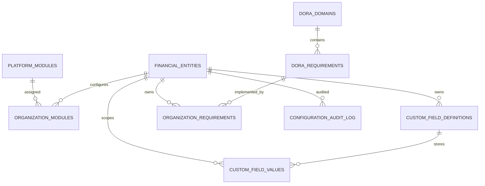

# Configuration layer — database architecture

## Principle

```text
DORA REGULATORY BASELINE (immutable seeds)
              │
              ▼
     STABLE CORE SCHEMA (unchanged domain tables)
              │
    ┌─────────┴─────────┐
    ▼                   ▼
STANDARD DATA    CONFIGURATION METADATA
                         │
           ┌─────────────┼─────────────┐
           ▼             ▼             ▼
      Modules    Custom Fields    Settings
           │             │
           └─────────────┴──► Organization Blueprint
```

**No runtime `ALTER TABLE` for tenants.**

## Organization = financial entity

API `{orgId}` = `financial_entities.id`.

## New tables

| Table | Role |
|-------|------|
| `platform_modules` | System module catalogue |
| `organization_modules` | Enabled modules per org |
| `organization_settings` | Key/value JSONB settings |
| `custom_field_definitions` | Field metadata per org + entity type |
| `custom_field_values` | JSONB values per entity instance |
| `dora_domains` | Baseline domains |
| `dora_requirements` | Baseline requirements |
| `organization_requirements` | Org applicability / status |
| `configuration_audit_log` | Config change audit |

## ER (config layer)



## Migrations

| Revision | Purpose |
|----------|---------|
| `3919f2be7fdd` | Config/metadata tables |
| `005_config_reference_data` | Seed modules + baseline requirements |

## API

FastAPI app: `app.api.main:app` — see `/docs` when running uvicorn.

Auth MVP: headers `X-Organization-Id`, `X-User-Id`, `X-User-Role` (`admin` for config mutations).

## Frontend

Not shipped — see `frontend/README.md`.
