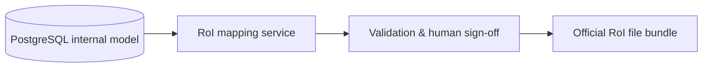

# DORA RoI mapping strategy

## Principle

| Layer | Role |
|-------|------|
| **Internal PostgreSQL model** | Normalized **source of truth** for supplier risk, contracts, chains, assessments, evidence, and controls. |
| **RoI export / mapping layer** (future) | Transforms internal rows into **official DORA Register of Information (RoI) template fields** at generation time. |
| **RoI templates** (future) | Regulatory reporting artefacts — **not** primary database tables in this MVP. |

Do not duplicate RoI JSON/XML shapes inside PostgreSQL. Store facts once; map on export.

## Mapping table (initial)

| Internal entity | Internal field(s) | Future RoI template area | RoI field (indicative) |
|-----------------|-------------------|----------------------------|-------------------------|
| `financial_entities` | `legal_name`, `lei`, `country_code` | Entity identification | Reporting financial entity |
| `ict_providers` | `legal_name`, `lei`, `euid`, `country_code`, `provider_type`, `status` | ICT third-party register | Provider identity & classification |
| `contracts` | `reference_number`, `start_date`, `end_date`, `contract_type`, `governing_law`, `status` | Contractual arrangements | Contract reference & lifecycle |
| `ict_services` | `name`, `classification_id` → `service_classifications.code`, `data_*_location`, `supports_critical_or_important` | ICT services | Service type, location, C/I flag |
| `business_functions` | `name`, `function_identifier`, `critical_or_important` | Critical/important functions | Function ID & C/I classification |
| `function_service_mappings` | `function_id`, `service_id` | Function ↔ ICT dependency | Supported functions per service |
| `subcontractors` | recursive chain, `lei`, `processing_location`, `depth_rank` | Subcontracting chain | Nth-party disclosure |
| `risk_assessments` | dimension inputs + `resulting_risk_level`, `calculated_at` | Risk assessment | Historical risk profile (derived on export) |
| `evidence` | `storage_provider`, `storage_object_key`, `content_hash`, dates | Evidence / audit trail | Supporting documentation references (URI built at export if needed) |
| `contract_dora_controls` | `compliance_status`, `approved_by`, `approved_at` | Contractual provisions | Control compliance (human-approved) |
| `exit_strategies` | `rto_hours`, `rpo_hours`, `migration_strategy`, `test_result` | Exit plans | Exit & transition planning |
| `audit_records` | `entity_type`, `entity_id`, `action`, `old_value`, `new_value` | Governance | Change history for RoI regeneration |

## Export flow (future)

## Versioning

- `risk_assessments.calculation_version` and migration timestamps support **point-in-time** RoI regeneration.
- `audit_records` with action `generate_roi` will record each export event (application layer, future).

## Out of scope for this document

- Field-level mapping for all 15 RoI templates (to be added when ESMA/EBA final templates are bound in the export layer).
- XBRL/JSON schema validation (export layer).
