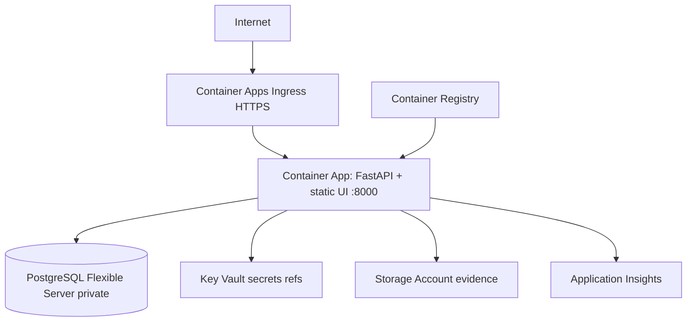

# Azure IaC — Architecture Assessment (pre-Terraform)

## 1. What exists today

| Area | Finding |
|------|---------|
| **Terraform / Azure RM** | None in repository. No `*.tf`, no remote state, no import maps. |
| **Containers** | `Dockerfile.app` — single image: FastAPI + built React on port **8000** (`SERVE_FRONTEND=1`). Optional split: `backend/Dockerfile`, `frontend/Dockerfile` (dev). |
| **Orchestration (local)** | `docker-compose.yml`: Postgres 16, optional `full` profile for app container. |
| **Database** | Application-managed schema via **Alembic**; connection via `DATABASE_URL`, optional `DB_SSL_MODE`. |
| **Storage** | Pluggable evidence storage; `local` default. `azure_blob` via env (`AZURE_STORAGE_ACCOUNT`, `AZURE_STORAGE_CONTAINER`) — adapter stub, no SDK required in core. |
| **Secrets** | `.env` / host env (`JWT_SECRET_KEY`, `DATABASE_URL`). Cloud discovery uses server-side Azure SP env vars (application feature, not deploy infra). |
| **CI/CD** | No `.github/workflows` in repo. |
| **Azure resources in repo** | **None** documented with resource IDs. Any live Azure estate must be discovered via `az resource list` and imported explicitly. |

## 2. What Terraform should manage

- Resource groups, tags, naming
- Hub/spoke-style **VNet**, subnets, NSGs (least privilege)
- **PostgreSQL Flexible Server** (infra only; not app data)
- **Key Vault** + secret **slots** (values from Terraform `random_password` at provision time, not committed)
- **Storage Account** + containers (`evidence`, `exports`)
- **ACR** (admin disabled; `AcrPull` via managed identity)
- **Log Analytics** + **Application Insights**
- **Container Apps Environment** + **Container App** (unified app image)
- Diagnostic settings (where supported)
- RBAC role assignments for managed identities

## 3. What stays application-managed

- FastAPI business logic, DORA/resilience domain
- Alembic migrations and seed scripts
- PostgreSQL data and extensions (except server/database created as empty shell)
- Azure resource **discovery** for customer subscriptions (runtime SP/MI — separate from deploy identity)
- Evidence blob **content**

## 4. Required Azure resources (minimal production path)

1. Resource group  
2. VNet + subnets (Container Apps + PostgreSQL delegation)  
3. PostgreSQL Flexible Server 16 + database  
4. Key Vault  
5. Storage Account (evidence)  
6. ACR  
7. Log Analytics + Application Insights  
8. Container Apps Environment + Container App (ingress TLS)  

**Not included by default:** AKS, Front Door, Application Gateway (optional variables for future; ACA ingress is sufficient for many deployments).

## 5. Import vs create

- **No import targets are encoded** — there are no existing resource IDs in git.
- Before first `apply` in a subscription that already has similarly named resources, run discovery and use `terraform import` (documented in README).
- **Do not** destroy existing production resources to align state; import or use new names/environment.

## 6. Target flow

