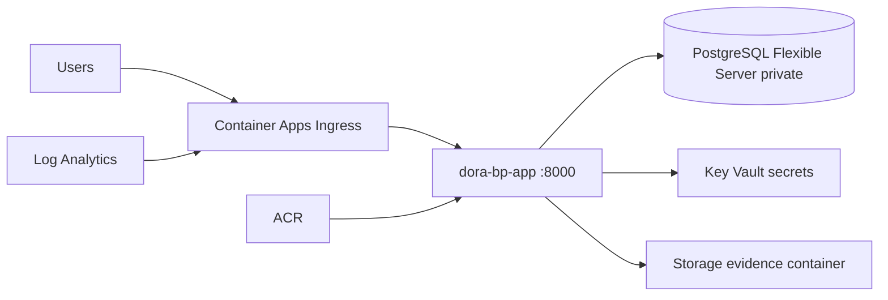

# Azure Terraform — DORA Business Resilience Blueprint

Infrastructure as Code for deploying the **containerized** application (`Dockerfile.app`: FastAPI + React on port 8000) on Azure.

See [ARCHITECTURE-ASSESSMENT.md](./ARCHITECTURE-ASSESSMENT.md) before first apply.

## Architecture (summary)



| Layer | Technology |
|-------|------------|
| Compute | Azure Container Apps |
| Database | PostgreSQL Flexible Server 16 (private VNet) |
| Secrets | Key Vault + managed identity |
| Evidence files | Storage Account (`evidence`, `exports`) |
| Images | ACR (admin disabled, AcrPull via MI) |
| Observability | Log Analytics + Application Insights |

**Not in scope:** AKS, Front Door (optional future), application data, Alembic migrations, DORA compliance logic.

## Prerequisites

- Terraform >= 1.5
- Azure CLI (`az login`)
- Optional: `./scripts/azure/inspect-subscription.sh` and `./scripts/azure/deploy-dev.sh` for incremental dev deploy (see `scripts/azure/README.md`)
- Subscription with permissions to create RGs, networking, PostgreSQL, ACA, ACR, KV, Storage
- **Container image** built and pushed to ACR before the app will start:

```bash
cd Azelos_DORA_BP
az acr login --name <acr_name>
docker build -f Dockerfile.app -t <acr_login_server>/dora-bp-app:1.0.0 .
docker push <acr_login_server>/dora-bp-app:1.0.0
```

## Azure region (subscription policy)

Your **`location`** must be a region where **your subscription** is allowed to deploy (Azure Policy or subscription “best available regions”). If only one region works (e.g. `spaincentral`), use it **everywhere**:

| Stack | File |
|-------|------|
| Remote state bootstrap | `bootstrap/terraform.tfvars` → `location` |
| Dev / staging / prod | `environments/<env>/terraform.tfvars` → `location` |

Bootstrap defaults to `westeurope` in `variables.tf` if you do not pass `location`. That will fail with `RequestDisallowedByAzure` when your subscription is restricted to another region.

Use the same region for bootstrap and app stacks unless your cloud team explicitly allows cross-region state.

Bootstrap tfstate storage defaults to **LRS** because **GRS is not available in every region** (e.g. `spaincentral` returns `RedundancyConfigurationNotAvailableInRegion` with `Standard_GRS`).

PostgreSQL Flexible Server: if apply fails with `zone can only be changed when exchanged with…`, the server already exists with an Azure-assigned zone. Pull the latest `postgres` module (`lifecycle { ignore_changes = [zone] }`) or set `zone` in the module call to match `az postgres flexible-server show … --query availabilityZone`.

Container Apps environment (`ManagedEnvironmentInvalidNetworkConfiguration`): with **azurerm ~4.14** and custom VNet, the infrastructure subnet must be **at least /21**, **delegated** to `Microsoft.App/environments`, and the environment needs a **Consumption workload profile** (see `modules/compute/main.tf`). A `/23` non-delegated subnet often fails with a vague “Invalid vnet resource ID” error. See [TROUBLESHOOTING-CAE-VNET.md](./TROUBLESHOOTING-CAE-VNET.md). Verify with:

```bash
az network vnet subnet show -g dora-bp-dev-rg -n snet-containerapps --vnet-name dora-bp-dev-vnet \
  --query "{prefix:addressPrefix, delegations:delegations}" -o json
```

## Remote state bootstrap (once per subscription)

```bash
cd infra/terraform/bootstrap
cp terraform.tfvars.example terraform.tfvars   # set location to your allowed region
terraform init
terraform plan -var-file=terraform.tfvars
terraform apply -var-file=terraform.tfvars   # review first
```

Copy outputs into `environments/<env>/backend.hcl` (see `backend.hcl.example`).

Configure backend on init:

```bash
cd ../environments/dev
terraform init -backend-config=backend.hcl
```

State is stored in Azure Storage; **never commit** `terraform.tfstate` or secret `.tfvars`.

## Environment deployment

### Dev

```bash
cd infra/terraform/environments/dev
cp terraform.tfvars.example terraform.tfvars   # edit container_image
terraform init -backend-config=backend.hcl
terraform fmt -check -recursive
terraform validate
terraform plan
# terraform apply   # after review
```

### Staging / Prod

Same flow under `environments/staging` or `environments/prod`. **Production apply requires manual approval** in CI and should not run from unreviewed plans.

## Post-apply application steps

1. PostgreSQL is **private** — run Alembic from a agent inside the VNet (Container Apps Job, VM jump box, or CI runner with private connectivity):

```bash
export DATABASE_URL='...'  # from Key Vault, not Git
python -m alembic upgrade head
python scripts/seed_api_user.py
```

2. Verify `https://<application_url>/health` and `/ready`.

3. Configure runtime Azure discovery (optional) with separate SP secrets — **not** stored in Terraform outputs.

## Secrets

| Secret | Source |
|--------|--------|
| PostgreSQL admin password | `random_password` → Key Vault `postgresql-admin-password` |
| `DATABASE_URL` | Key Vault `database-url` (referenced by Container App) |
| `JWT_SECRET_KEY` | Key Vault `jwt-secret-key` |

Terraform marks sensitive values; **do not** print or output passwords.

## Importing existing Azure resources

No resource IDs are stored in this repository. If resources already exist:

```bash
terraform import module.platform.module.resource_group.azurerm_resource_group.this /subscriptions/.../resourceGroups/...
```

Document each import in your runbook. **Do not destroy** production resources to reconcile state.

## Security notes

- PostgreSQL: `public_network_access_enabled = false`, delegated subnet only.
- NSGs attached to subnets (no broad internet → 5432 rules).
- ACR admin disabled; pull via managed identity.
- Storage: HTTPS-only, private containers.
- Key Vault: RBAC, optional IP restrictions via `key_vault_allowed_ip_ranges`.

Run static analysis (optional):

```bash
tfsec infra/terraform
# or checkov -d infra/terraform
```

## CI/CD

GitHub Actions workflow `.github/workflows/terraform.yml` runs `fmt`, `validate`, and optional `plan` (with Azure credentials). Production **apply** is manual only.

## Rollback / destroy

- Rollback app: deploy previous container image tag in Container App.
- Rollback infra: `terraform plan` to previous code revision; avoid `destroy` in prod without backup verification.
- PostgreSQL PITR depends on configured retention (see environment `main.tf`).

## Directory layout

```
infra/terraform/
├── ARCHITECTURE-ASSESSMENT.md
├── README.md
├── bootstrap/                 # remote state storage (one-time)
├── modules/
│   ├── resource_group/
│   ├── networking/
│   ├── postgres/
│   ├── key_vault/
│   ├── storage/
│   ├── container_registry/
│   ├── monitoring/
│   ├── compute/               # Container Apps
│   └── platform/              # composes all modules
└── environments/
    ├── dev/
    ├── staging/
    └── prod/
```

## Backup / recovery assumptions

| Environment | Backup retention | Geo-redundant backup |
|-------------|------------------|----------------------|
| dev | 7 days | no |
| staging | 14 days | no |
| prod | 35 days | yes |

Documented RPO/RTO are **not guaranteed** until validated with restore drills.
